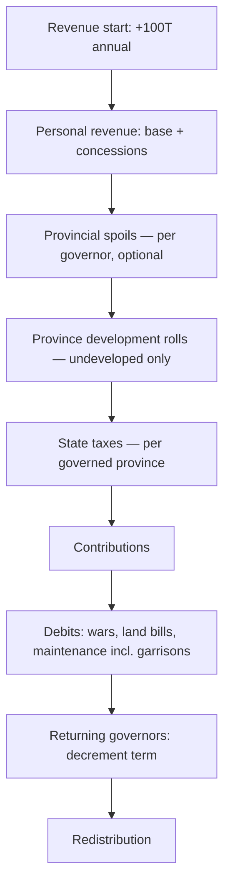
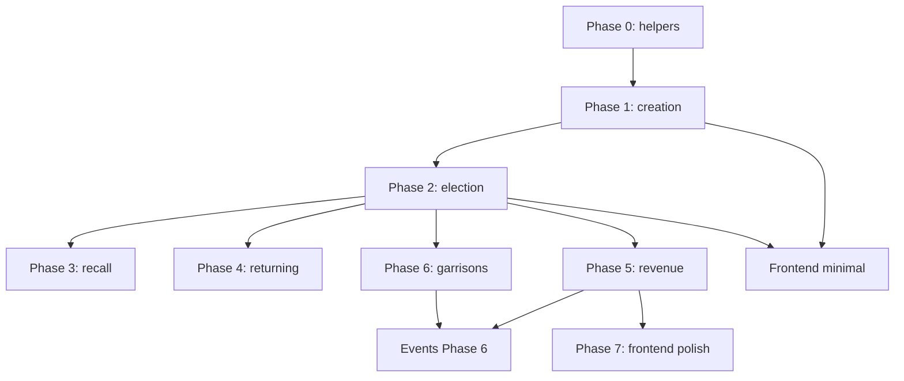

# Provinces Implementation Plan

## Current state

| Layer | Status |
|---|---|
| Rules & component data | Complete in `game-data/components/provinces.md` |
| `rorcli` parser | Complete (`rorcli/parsers/provinces.py`) |
| Backend reference data | Complete — `backend/rorapp/data/province.json` (15 provinces), validated by `province_data_test.py` |
| `Province` model | Minimal — `game`, `name`, `developed` (default `false`); unique `(game, name)` |
| Game state API | `provinces` included in public game state; `GameStateSnapshot.get_province()` |
| Frontend types | `Province.ts` + `PublicGameState` parsing only — no UI |
| Gameplay | **Not started** — no creation, governorships, revenue, garrisons, or development |

README checklist items still open:

- Revenue: Provincial spoils, Provincial development, Returning governors
- Senate: Governor election, Governor recall
- Combat: New province

Several random events (Barbarian Raids, Internal Disorder, Trial of Verres, Pretender Emerges) are blocked on province mechanics — see `docs/events-implementation-plan.md` Phase 6.

---

## Design goals

1. Ship incrementally: each PR unlocks testable, player-visible behaviour.
2. Reuse existing patterns: `EffectBase` pipeline, senate proposal actions, `RandomResolver`, `Log.create_object`.
3. Keep static card data in JSON; store only per-game runtime state on the model.
4. Early Republic basic rules first; advanced rules (Provincial Wars, Rebel Governors) and scenario starting provinces deferred.
5. Coordinate with the events plan — province-dependent events should land after core governorship + revenue mechanics exist.

---

## Proposed architecture

### 1. Static vs runtime data

**`province.json`** (already exists) holds per-card reference data:

- `undeveloped` / `developed` stat blocks: `spoils`, `state` (tax dice), `taxes` (fixed local tax), `land_base`, `land_max`, `naval_base`, `naval_max`
- `frontier` (boolean)
- `created_by` (war or event that creates the province)
- `defends` (`war_names`, `war_series`)

**`Province` model** holds per-game runtime state only:

| Field | When to add | Notes |
|---|---|---|
| `developed` | Done | Flips on successful improvement roll (1.06.4) |
| `governor` | Phase 2 | Nullable FK to `Senator`; `null` = province in Forum |
| `term` | Phase 2 | 1–3 while governed; `null` in Forum |
| `elected_this_turn` | Phase 2 | Boolean; blocks recall (1.09.52) |

Do **not** denormalize `spoils`, `state`, `taxes`, `frontier`, or land/naval strengths onto the model. Derive them at runtime from JSON via `name` (+ `developed` for stat blocks):

```python
# backend/rorapp/helpers/provinces.py

def get_province_definition(name: str) -> dict: ...
def get_province_stats(province: Province) -> dict: ...
def provinces_created_by(war_name: str) -> list[str]: ...
```

`provinces_created_by()` must handle compound `created_by` strings (e.g. `"Bequest or 2nd Cilician Pirates"`) by matching the defeating war name against each alternative.

### 2. Dice expression helper

Province spoils and state income use expressions like `"1d6-1"`, `"2d6-4"`, `"-1d6"`. Add a shared helper:

```python
# backend/rorapp/helpers/dice_expression.py

def roll_dice_expression(expr: str, random_resolver: RandomResolver) -> int: ...
```

Used by provincial spoils (1.06.13), state taxes (1.06.51), and later event resolvers. Tests in `tests/internals/`.

### 3. Garrisons

Garrisoned Legions are Legions assigned to a Province, not a Campaign. Extend `Legion`:

```python
province = models.ForeignKey(
    Province, related_name="garrisons", blank=True, null=True, on_delete=models.SET_NULL
)
```

Invariant: a Legion has at most one of `campaign` or `province` set. Garrisons follow the province to the Forum when the governorship expires (1.06.6, 1.09.646).

### 4. Senate sub-phase insertion

Governorship elections run **after Prosecutions, before Other Business** (1.09.5). Add a new sub-phase:

```
Game.SubPhase.GOVERNOR_ELECTION = "governor election"
```


- Enter `GOVERNOR_ELECTION` when prosecutions end **if** any province has `governor=None`.
- If multiple vacant provinces exist, elections may be grouped in one vote (1.09.5).
- At `SenatePhaseEndEffect`: assert all provinces have governors unless no eligible candidates remain in Rome (1.09.54).

### 5. Revenue phase expansion

Current `RevenueEffect` runs personal revenue, state debits, and redistribution in one shot. Province mechanics require splitting into ordered steps:



Provincial spoils need a **player choice** (collect or decline before rolling, 1.06.13). Implement as a revenue sub-phase with per-faction actions, not as automatic rolls in an effect.

### 6. Serializer / frontend exposure

Extend `ProvinceSerializer` with computed read-only fields (no DB columns):

```python
# SerializerMethodField or to_representation override
stats       # current undeveloped/developed block
frontier    # from province.json via get_province_definition
governor    # senator id or nested summary
in_forum    # governor is None
```

Frontend `ProvinceData` interface updated in the same PR as each backend phase that exposes new fields.

---

## Implementation phases

### Phase 0 — Helpers (1 PR, can merge with Phase 1)

**Goal:** Shared infrastructure with no player-visible change.

- [ ] Add `helpers/provinces.py` (`get_province_definition`, `get_province_stats`, `provinces_created_by`)
- [ ] Add `helpers/dice_expression.py` + internals tests
- [x] Extend `ProvinceSerializer` with computed `frontier` (from JSON)
- [ ] Extend `ProvinceSerializer` with computed `stats`
- [ ] Tests: stat lookup for developed/undeveloped; `provinces_created_by` for each war that creates a province

### Phase 1 — Province creation (1 PR)

**Goal:** Winning a war creates province(s) in the Forum.

Rules: 1.10.4 (land victory eliminates war; provinces created in some cases).

- [ ] On land victory when `war_ends` in `resolve_combat.py`:
  - Look up province names via `provinces_created_by(war.name)`
  - Skip provinces that already exist for this game
  - Create `Province(game, name, developed=False)` for each
  - Log: `"Sicilia was established as a province."`
- [ ] Handle edge cases:
  - Naval-only victory does not create provinces (land victory required per 1.10.4)
  - Multiple provinces from one war (if any)
  - Compound `created_by` strings
- [ ] After combat phase, if new provinces exist and next phase is Senate, ensure governorship sub-phase triggers
- [ ] Tests: `tests/s1_basic_game/s1_10_combat_phase/` — victory over war X creates expected province(s); no duplicate on re-match; no province on stalemate

**Frontend (minimal):** Provinces section in `GameContainer.tsx` listing Forum provinces (name, undeveloped/developed, frontier badge). No actions yet.

**README:** Mark "New province" done.

### Phase 2 — Governor election (1 PR)

**Goal:** Vacant provinces in the Forum are filled during the Senate Phase.

Rules: 1.09.5, 1.09.51 (term set to 3), 1.09.53 (unaligned), 1.09.54 (vacancy enforcement).

- [ ] Migration: `governor` (FK Senator, null), `term` (int 1–3, null), `elected_this_turn` (bool)
- [ ] Add `GOVERNOR_ELECTION` sub-phase; wire transitions from `PROSECUTION` → `GOVERNOR_ELECTION` → `OTHER_BUSINESS`
- [ ] New action: `ProposeElectGovernorAction`
  - Eligible candidates: senators in Rome, alive, not holding Major Office (1.09.5)
  - Support grouped election for multiple vacant provinces
  - On passage: set `governor`, `term=3`, `elected_this_turn=True`; move senator `location` away from Rome; adjust faction vote tally
- [ ] Unaligned senator elected: immune to persuasion until return (status item); no spoils eligibility flag
- [ ] `SenatePhaseEndEffect`: if vacant provinces remain and eligible candidates exist, block adjournment / auto-queue election
- [ ] Governor death mid-senate: re-open election for that province (1.09.54)
- [ ] Tests: election assigns governor and removes senator from Rome; major office holder ineligible; unaligned rules; vacancy enforcement

**Frontend:** Governor election proposal form; province cards show assigned governor and term.

**README:** Mark "Governor election" done.

### Phase 3 — Governor recall (1 PR)

**Goal:** Senate can recall a sitting governor by electing a replacement.

Rules: 1.09.52.

- [ ] New action: `ProposeRecallGovernorAction` (or extend governor election to handle replacement)
  - Target province with non-rebel governor not elected this turn
  - Replacement candidate in Rome; new `term=3`; returning governor to Rome
  - Garrison legions stay on province
- [ ] Consent rules for re-election same turn (1.09.51) — track `returned_this_turn` status on senators
- [ ] Tests: recall blocked if elected this turn; replacement inherits province and term reset

**README:** Mark "Governor recall" done.

### Phase 4 — Returning governors (1 PR)

**Goal:** Governorship terms expire at end of Revenue Phase.

Rules: 1.06.6.

- [ ] New effect step at end of revenue (before or within `RevenueEffect` refactor): for each non-rebel governed province, `term -= 1`
- [ ] When `term` reaches 0: clear `governor`, return senator to Rome, move province to Forum (`governor=None`, `term=None`), garrison legions remain attached to province card in Forum
- [ ] Corrupt marker persists on returning governor (1.06.6)
- [ ] Tests: term countdown; return after 3 revenue phases; rebel governor exempt from term reduction

**README:** Mark "Returning governors" done.

### Phase 5 — Provincial revenue (1–2 PRs)

**Goal:** Governors generate spoils and state taxes; undeveloped provinces may develop.

Rules: 1.06.13, 1.06.4, 1.06.51, 1.06.53 (negative income debits).

**PR A — Spoils & development**

- [ ] Revenue sub-phase: `PROVINCIAL_SPOILS` with per-governor faction actions (`CollectProvincialSpoilsAction`, `DeclineProvincialSpoilsAction`)
- [ ] On collect: add Corrupt marker (unless already corrupt), roll `spoils` expression, credit governor personal treasury; negative net debited from State in debits step
- [ ] After spoils: auto-roll development for each undeveloped governed non-rebel province (1.06.4)
  - +1 drm if governor not corrupt
  - Roll 6 → `developed=True`, governor +3 influence
  - Skip if province under attack (stub guard until Provincial Wars / events exist)
- [ ] Tests: spoils roll; corrupt marker; decline path; development flip and influence

**PR B — State taxes & debit integration**

- [ ] Roll `state` expression per governed non-rebel province; adjust `state_treasury`
- [ ] Fixed `taxes` value (local tax) — confirm rulebook treatment vs state income roll
- [ ] Unaligned governors: state taxes only, no spoils (1.09.53)
- [ ] Vacant / rebel provinces: no taxes (1.06.51)
- [ ] Refactor `RevenueEffect` into ordered sub-phases (see diagram above)
- [ ] Tests: positive and negative state income; unaligned governor; vacant province skipped

**README:** Mark "Provincial spoils" and "Provincial development" done.

### Phase 6 — Garrisons (1 PR, basic game)

**Goal:** Senate deploys Legions to provinces for event protection.

Rules: 1.09.646, 1.09.6461 (frontier); garrison maintenance in 1.06.53.

- [ ] Migration: `Legion.province` FK
- [ ] Actions: `ProposeDeployGarrisonAction`, `ProposeRecallGarrisonAction`
  - Cannot deploy to rebel governor province
  - Cannot recall same turn deployed
  - Garrisons recall to Active Forces when province returns to Forum (or stay on province — confirm rule: they follow province to Forum, 1.09.646)
- [ ] Garrison maintenance: 2T per garrison legion in debits (in addition to active-force maintenance? verify 1.06.53 — garrisoned legions may be exempt from standard maintenance while garrisoned)
- [ ] Expose `garrisons` on province serializer (legion ids)
- [ ] Tests: deploy, recall restrictions, legions follow province to Forum

Defer combat use of `land_base` until Provincial Wars advanced rule.

### Phase 7 — Frontend polish (1 PR)

**Goal:** Complete province UX once backend phases 1–6 land.

| Change | Component |
|---|---|
| Provinces panel with Forum vs governed grouping | `GameContainer.tsx` |
| Stat display (taxes, spoils dice, land/naval base) | Province card component |
| Governor + term + garrison chips | Province card |
| Governor election / recall forms | New custom action forms |
| Revenue spoils collect/decline | Revenue-phase action UI |
| Development result in log | `LogList` (likely sufficient initially) |

### Phase 8 — Scenario starting provinces (1 PR, deferrable)

**Goal:** Middle/Late Republic setup deals starting provinces.

Rules: 3.02.4, 3.03.4.

- [ ] Extend `start_game.py` / scenario config to create pre-assigned provinces
- [ ] Player choice of term (1–3) during setup — may need a setup-phase action
- [ ] Deal undeveloped vs developed per scenario

Not required for Early Republic basic game.

---

## Out of scope (separate future tracks)

| Feature | Rule section | Notes |
|---|---|---|
| Provincial Wars | 2.02 | War attacks on provinces; governor military rating in battle |
| Rebel Governors | 2.03 | Revolt as governor; rebel province income |
| Garrison recall from rebel province | 1.09.646 | Blocked until rebel governors |
| Capture | 1.10.71+ | Commander captured — separate README item |
| Event interactions | 1.07.21 table | Barbarian Raids, Internal Disorder, Trial of Verres — coordinate with events plan Phase 6 |
| `defends` linkage | province.json | Provincial Wars: province strength against specific wars |

---

## Cross-cutting dependencies



**Events plan coordination:**

| Event | Minimum province dependency |
|---|---|
| Trial of Verres | Phase 5 revenue (per-province income/spoils) |
| Internal Disorder | Phase 2 governorship + Phase 5 development |
| Barbarian Raids | Phase 6 garrisons + `frontier` + governor presence |
| Pretender Emerges | Province revolt → war creation |

Implement stub guards in event resolvers (`if no governed provinces: skip`) until the relevant province phase ships.

---

## Testing strategy

Follow existing conventions (`tests/s1_basic_game/...`, AAA structure, `execute_effects_and_manage_actions`).

**Per phase, minimum tests:**

1. Happy path for the new mechanic
2. Eligibility / validation rejections
3. Edge cases called out in rulebook (unaligned governor, vacant province, elected-this-turn recall block)
4. State persistence across phase transitions (`refresh_from_db()`)

**Suggested test locations:**

| Phase | Directory |
|---|---|
| 1 | `s1_10_combat_phase/s1_10_4_victory/` |
| 2–3 | `s1_09_senate_phase/s1_09_5_governorships/` |
| 4–5 | `s1_06_revenue_phase/s1_06_13_provincial_spoils/`, `s1_06_4_development/`, `s1_06_6_returning_governors/` |
| 6 | `s1_09_senate_phase/s1_09_646_garrisons/` |

Keep `tests/internals/province_data_test.py` as the guard for JSON ↔ rulebook parity.

---

## PR stack summary

| PR | Phase | Delivers |
|---|---|---|
| 1 | 0 + 1 | Helpers, province creation on war victory, minimal UI |
| 2 | 2 | Governor election sub-phase |
| 3 | 3 | Governor recall |
| 4 | 4 | Term expiry / return to Forum |
| 5 | 5a | Provincial spoils + development |
| 6 | 5b | State taxes + revenue sub-phase refactor |
| 7 | 6 | Garrisons |
| 8 | 7 | Frontend polish |
| 9 | 8 | Scenario starting provinces (optional / later) |

Phases 3 and 4 can ship in either order after Phase 2. Phase 6 can parallel Phase 5 if garrison maintenance is stubbed initially.

## Progress

### Phase 0 — Helpers

- [x] `helpers/provinces.py` — `award_provinces_for_war`, `get_province_definition`, `provinces_created_by` (compound `created_by`, Illyrian wars)
- [x] Internals tests for province awardment logic
- [ ] `get_province_stats()`
- [ ] `helpers/dice_expression.py` + tests *(deferred until Phase 5 revenue)*
- [x] `ProvinceSerializer` — computed `frontier` (from JSON), `in_forum`
- [ ] Serializer `stats` block *(deferred until needed for UI/revenue)*

---

### Phase 1 — Province creation

- [x] Award provinces on war end in `resolve_combat.py`
- [x] Skip duplicates; log each created province
- [x] Compound `created_by` / multi-province wars (e.g. 1st Punic, 2nd Punic)
- [x] Both Illyrian Wars gate for Illyricum
- [x] Combat integration tests (`s1_10_4_province_award_test.py`)
- [x] Explicit land-victory-only guard for province award
- [ ] Trigger governorship sub-phase after combat when Senate follows *(Phase 2)*
- [ ] README: mark **New province** done

**Frontend (minimal)**

- [x] Forum provinces panel in `GameContainer.tsx` (name, developed/undeveloped, frontier badge)
- [x] `Province.ts` types updated
- [x] Playwright coverage (`provinces.spec.ts`)

---

### Phase 2 — Governor election

- [ ] Migration: `governor`, `term`, `elected_this_turn`
- [ ] `GOVERNOR_ELECTION` senate sub-phase
- [ ] `ProposeElectGovernorAction` (+ grouped elections)
- [ ] Unaligned governor rules (1.09.53)
- [ ] Vacancy enforcement at senate end (1.09.54)
- [ ] Governor death mid-senate → re-election
- [ ] Tests + frontend election UI
- [ ] README: **Governor election**

---

### Phase 3 — Governor recall

- [ ] `ProposeRecallGovernorAction`
- [ ] Elected-this-turn / consent rules
- [ ] Tests
- [ ] README: **Governor recall**

---

### Phase 4 — Returning governors

- [ ] Term countdown at end of revenue phase
- [ ] Return to Forum when term expires
- [ ] Tests
- [ ] README: **Returning governors**

---

### Phase 5 — Provincial revenue

**Spoils & development**

- [ ] `PROVINCIAL_SPOILS` revenue sub-phase + collect/decline actions
- [ ] Development rolls (1.06.4)
- [ ] Tests

**State taxes & debit integration**

- [ ] State tax rolls per governed province
- [ ] `RevenueEffect` sub-phase refactor
- [ ] Tests
- [ ] README: **Provincial spoils**, **Provincial development**

---

### Phase 6 — Garrisons

- [ ] `Legion.province` FK
- [ ] Deploy / recall garrison actions
- [ ] Garrison maintenance in debits
- [ ] Tests

---

### Phase 7 — Frontend polish

- [ ] Forum vs governed grouping
- [ ] Stat display (taxes, spoils dice, land/naval base)
- [ ] Governor + term + garrison chips
- [ ] Revenue spoils UI

---

### Phase 8 — Scenario starting provinces *(deferrable)*

- [ ] Middle/Late Republic setup provinces
- [ ] Term choice during setup

---

### Out of scope (separate tracks)

Provincial Wars, rebel governors, capture, province-dependent events (Barbarian Raids, Internal Disorder, Trial of Verres, Pretender Emerges).
